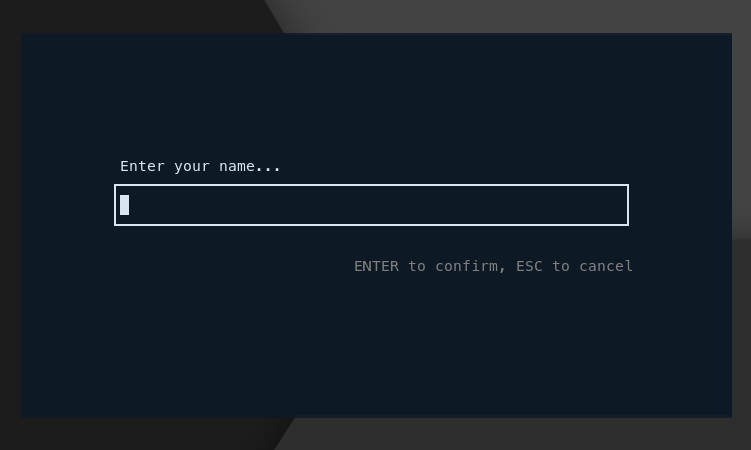
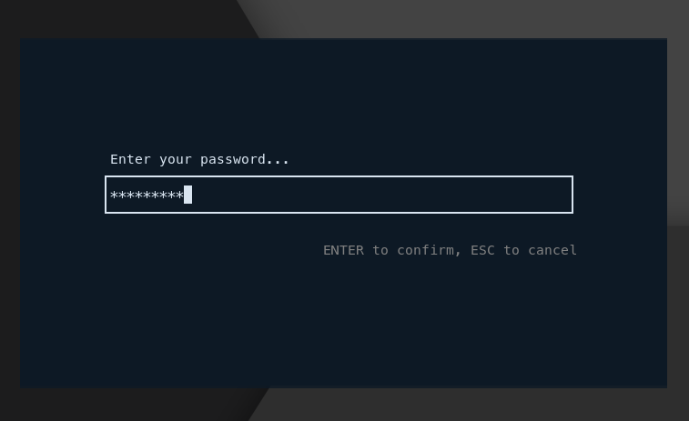
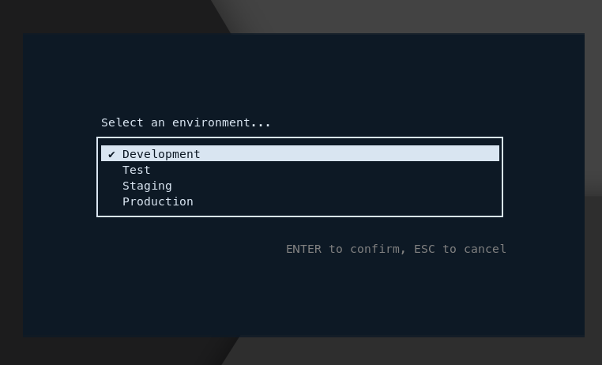
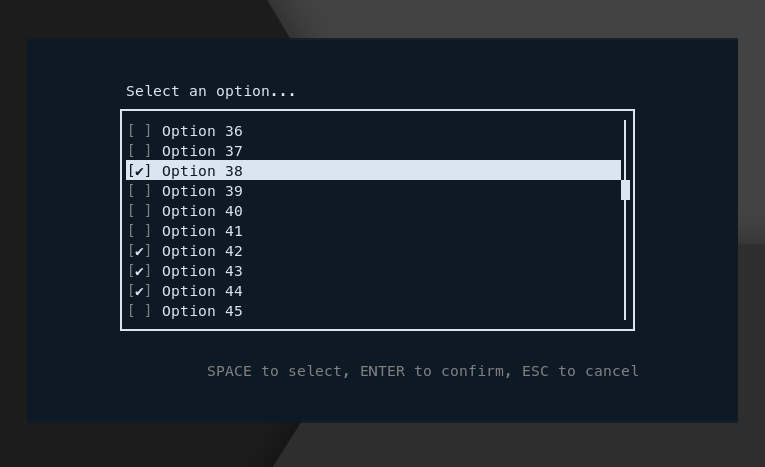
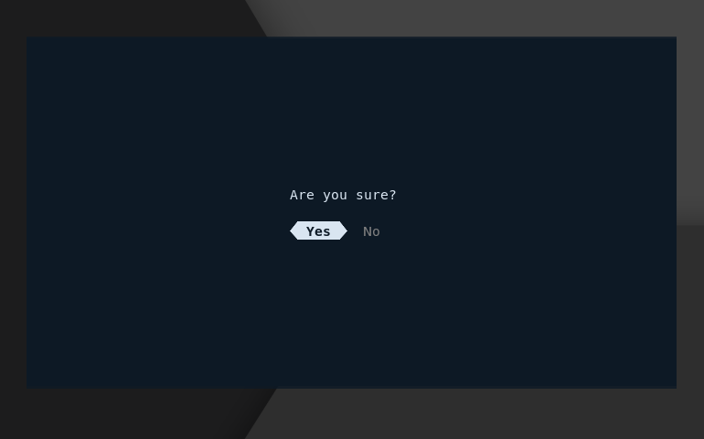

# Flinch

A collection of terminal-based widgets for richer Golang CLI apps.

Ships with a library to build your own widgets/TUIs too.

**Warning**: This module is experimental right now.

### Input



```golang
name, _ := widgets.Input("Enter your name...")
```

### Password Input



```golang 
password, _ := widgets.PasswordInput("Enter your password...")
```

### List Selection



```golang
_, item, err := widgets.ListSelect(
    "Select an environment...",
    []string{
        "Development",
        "Test",
        "Staging",
        "Production",
    },
)
```

### Multi List Selection



```golang
_, items, err := widgets.MultiSelect(
    "Select an option...",
    options,
)
```

(scrollbars appear for long lists)

### Confirmation



```golang
userConfirmed, _ := widgets.Confirm("Are you sure?")
```

## Build Your Own Widgets

Check out the [widgets](widgets) package for some inspiration.
